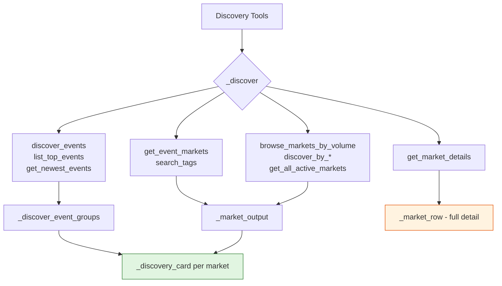

# Issue :
**1. Market Discovery returns only 1-2 markets (Argentina WC + Jesus Christ)**

- **Root cause**: `_market_rows()` at [`src/vtrade/production_tools.py:311-316`](src/vtrade/production_tools.py:311) queries only `self._context.market_snapshot_ids` — the **frozen snapshot set** from the cycle. The cycle freezes only 10-11 market IDs, and of those, only 1-2 are `status='open' AND tradeable=true`. All discovery tools (`discover_events`, `discover_hot_markets`, `list_top_events`, `search_tags`, `browse_markets_by_volume`, `discover_by_time_remaining`, `discover_by_price_volatility`, `get_newest_events`, `get_all_active_markets`) all call `_market_rows(100)` then filter — so they all return the same tiny subset.

- **Evidence**: Cycle 1 `discover_events("Argentina Spain World Cup final")` → empty. `discover_events("FIFA World Cup")` → empty, `truncated: true`. `list_top_events` → empty, `truncated: true`. `discover_hot_markets` → empty. Only `discover_events("Argentina")` finds the market. This pattern repeats identically across all 3 cycles.


# Recommended response

### 1. Make discovery results compact before expanding the universe

Use a dedicated discovery-card representation rather than `_market_row()` for every search result. A suitable default is:

```json
{
  "market_ref": "558938",
  "question": "Will Argentina win the 2026 FIFA World Cup?",
  "closes_at": "2026-07-20T00:00:00Z",
  "volume_24h_micros": 2517353301182,
  "liquidity_micros": 7834524223400,
  "competitive": 0.9919,
  "status": "open",
  "tradeable": true,
  "tag_names": ["Sports", "Soccer", "FIFA World Cup"],
  "outcomes": [
    {"name": "Yes", "indicative_price": "0.4095"},
    {"name": "No", "indicative_price": "0.5905"}
  ]
}
```


# Fix Plan

**Problem:** `_market_row()` (line 691) returns 14 fields including full `metadata` (with tag objects, resolution rules, internal IDs) and raw `outcomes` JSON. Each row averages ~3,464 bytes, so a single result already consumes nearly the entire 4,000-byte ceiling.

**Changes:**

1. **Add `_discovery_card()`** — a new compact serializer at module level, next to `_market_row()` (~line 715). It picks only the fields the verification doc specifies:

```python
def _discovery_card(row: Sequence[object]) -> JsonObject:
    meta = _metadata(row[12])
    tag_names = [
        t["label"] if isinstance(t, dict) and "label" in t else str(t)
        for t in (meta.get("tags") or [])
        if isinstance(t, (dict, str))
    ]
    raw_outcomes = row[13]
    outcomes = []
    if isinstance(raw_outcomes, list):
        for o in raw_outcomes:
            if isinstance(o, dict):
                outcomes.append({
                    "name": o.get("name", ""),
                    "indicative_price": str(o.get("price", "")),
                })
    return {
        "market_ref": str(row[0]),          # internal UUID — the one stable ref
        "question": str(row[4]),
        "closes_at": str(row[7]) if row[7] else None,
        "volume_micros": int(str(row[8])),
        "liquidity_micros": int(str(row[9])),
        "competitive": str(_metadata_decimal(row[12], "competitive")),
        "status": str(row[10]),
        "tradeable": bool(row[11]),
        "tag_names": tag_names,
        "outcomes": outcomes,
    }
```

2. **Replace `_market_row` with `_discovery_card` in all discovery paths.** Specifically, change `_market_output()` (line 321) from:

   ```python
   "markets": [_market_row(row) for row in rows],
   ```
   to:
   ```python
   "markets": [_discovery_card(row) for row in rows],
   ```

3. **Keep `_market_row()` for `get_market_details` only** (line 197–199). That path already returns a single market and is the right place for full resolution rules, outcome IDs, venue tokens, etc.

4. **For event-group tools** (`_discover_event_groups`, line 267), replace `_market_row(row)` inside the loop with `_discovery_card(row)`.

5. **Add `venue_token_id` per outcome to `get_market_details`** by expanding the `outcomes` field in `_market_row()` to include it (it's already in the raw JSON payload; just pass it through explicitly).

**Expected impact:** ~83% reduction in per-market discovery payload (3,464 → ~585 bytes). Several markets now fit in one response instead of one.


# Plan Review

## Overview

I reviewed the proposed fix plan against the actual source code in [`src/vtrade/production_tools.py`](src/vtrade/production_tools.py). The core idea — creating a lean `_discovery_card()` serializer to replace the heavyweight `_market_row()` in list-returning tools — is sound. However, I found several issues, edge cases, and improvement opportunities.

---

## Critical Issues

### 1. Missing `slug` field breaks the model's ability to call `get_market_details`

The proposed `_discovery_card` omits `slug` entirely, using only `market_ref` (internal UUID). However, [`get_market_details`](src/vtrade/production_tools.py:192-201) looks up markets by `slug`:

```python
slug = _required_string(arguments, "slug")
rows = self._query(
    _MARKET_SELECT + " AND snapshot.payload->>'slug' = %s "
    ...
)
```

**Impact:** The model discovers a market via `discover_events` or `browse_markets_by_volume`, gets a `market_ref` UUID, but cannot call `get_market_details` because the tool requires a `slug`, not a UUID. The model would be stuck.

**Fix:** Either:
- **(Recommended)** Add `slug` to `_discovery_card` — it's a short string and adds minimal payload weight.
- Alternatively, extend `get_market_details` to also accept `market_ref` (internal UUID) as a lookup key.

---

## Moderate Issues

### 3. No `venue_token_id` in discovery outcomes prevents order-book lookups

The discovery card's outcome serializer:

```python
outcomes.append({
    "name": o.get("name", ""),
    "indicative_price": str(o.get("price", "")),
})
```

Omits `token_id` / `venue_token_id`. If the model wants to check order-book depth on a discovered market, it needs the outcome's token ID to call [`get_orderbook`](src/vtrade/production_tools.py:336-376). Without it, the workflow is: discover → `get_market_details` (to get token IDs) → `get_orderbook`. Adding `token_id` to the discovery card would save an extra round-trip for the common case.

**Payload impact:** `"token_id": "0x1234..."` is ~50 bytes per outcome, which is negligible.

### 4. Tag extraction can produce ugly string representations

When a tag is a `dict` without a `"label"` key, the fallback is `str(t)`, which produces something like `"{'id': '123', 'name': 'sports'}"`. This is messy and unpredictable for the model.

**Fix:** Either extract `"name"` as a secondary key, or skip tags that have no recognizable label field:

```python
tag_names = []
for t in (meta.get("tags") or []):
    if isinstance(t, dict):
        label = t.get("label") or t.get("name")
        if label:
            tag_names.append(str(label))
    elif isinstance(t, str):
        tag_names.append(t)
```

**User choice :  skip tags with no label, and if easy to do, log a warning**

---

## Minor Issues

### 5. No `opens_at` field

Markets have an `opens_at` timestamp that indicates when trading begins. This is useful for the model to know if a market is upcoming vs. already trading. The `_market_row` includes it; `_discovery_card` drops it.

**Payload impact:** `"opens_at": "2026-06-15T00:00:00+00:00"` is ~35 bytes. Not critical but nice to have.

**User choice : do not include it, markets returned will always be open anyway**

### 6. No `event_id` in the discovery card

While [`_discover_event_groups`](src/vtrade/production_tools.py:270-309) includes `event_id` at the event-group level, the flat discovery tools (`browse_markets_by_volume`, `discover_by_time_remaining`, etc.) return markets without any event association. This prevents the model from calling `get_event_markets` to find related markets.

**Payload impact:** `"event_id": "uuid..."` is ~40 bytes.

---

## Edge Cases (all handled correctly ✅)

| Edge Case | How It's Handled | Status |
|-----------|-----------------|--------|
| **Null `closes_at`** | `str(row[7]) if row[7] else None` | ✅ |
| **Empty metadata** | `_metadata()` returns `{}` via `isinstance` check | ✅ |
| **Empty outcomes** | `isinstance(raw_outcomes, list)` guard | ✅ |
| **Non-dict outcomes** | Filtered by `isinstance(o, dict)` | ✅ |
| **Outcome missing `name`/`price`** | `.get("name", "")` / `.get("price", "")` | ✅ |
| **Non-dict, non-str tags** | Filtered by `isinstance(t, (dict, str))` | ✅ |
| **Missing `competitive` key** | `_metadata_decimal` returns `Decimal(0)` | ✅ |
| **Invalid `competitive` value** | `_metadata_decimal` catches `InvalidOperation` | ✅ |
| **UUID row[0]** | `str(row[0])` converts to string | ✅ |
| **Datetime row[7]** | `str(row[7])` produces ISO format | ✅ |
| **Decimal row[8]/row[9]** | `int(str(row[8]))` converts safely | ✅ |

---

## Potential Improvements

### 7. Expose `volume_24hr` in the discovery card

Many discovery tools sort by `volume_24hr` (from metadata), but the card doesn't show it. The model gets a ranked list but can't see *why* a market is ranked highly. Including `volume_24hr_micros` would provide transparency.

### 8. Consider renaming `market_ref` to `id` for consistency

The existing `_market_row` uses `"id"`. Renaming to `"market_ref"` in `_discovery_card` gives the model two different field names for the same concept across the two serializers. This could confuse the model. Keeping `"id"` is simpler.

### 9. The `competitive` field should be a number, not a string

```python
"competitive": str(_metadata_decimal(row[12], "competitive")),
```

This converts a `Decimal` to a string like `"0.85"`. The existing `_market_row` returns numeric values as native types. The model can compare numbers more easily than strings. Use `float()` or keep as `Decimal` (JSON-serializable via `default=str` in `_bounded_output`).

### 10. `_discovery_card` should also replace `_market_row` in `get_event_markets` and `search_tags`

The plan mentions this implicitly (since these go through `_market_output`), but it's worth stating explicitly. Both [`get_event_markets`](src/vtrade/production_tools.py:202-215) and [`search_tags`](src/vtrade/production_tools.py:216-219) call `self._market_output(rows)`, so changing `_market_output` covers them. ✅

---

## Revised `_discovery_card` Suggestion

```python
def _discovery_card(row: Sequence[object]) -> JsonObject:
    meta = _metadata(row[12])
    tag_names = []
    for t in (meta.get("tags") or []):
        if isinstance(t, dict):
            label = t.get("label") or t.get("name")
            if label:
                tag_names.append(str(label))
        elif isinstance(t, str):
            tag_names.append(t)
    raw_outcomes = row[13]
    outcomes = []
    if isinstance(raw_outcomes, list):
        for o in raw_outcomes:
            if isinstance(o, dict):
                outcomes.append({
                    "name": o.get("name", ""),
                    "indicative_price": str(o.get("price", "")),
                    "token_id": str(o.get("token_id", "")),
                })
    return {
        "id": str(row[0]),                     # internal UUID
        "slug": str(row[2]),                   # needed for get_market_details
        "event_id": str(row[3]),               # event association
        "question": str(row[4]),
        "opens_at": str(row[6]) if row[6] else None,
        "closes_at": str(row[7]) if row[7] else None,
        "volume_micros": int(str(row[8])),
        "liquidity_micros": int(str(row[9])),
        "status": str(row[10]),
        "tradeable": bool(row[11]),
        "competitive": float(str(_metadata_decimal(row[12], "competitive"))),
        "volume_24hr_micros": _metadata_money(row[12], "volume_24hr"),
        "tag_names": tag_names,
        "outcomes": outcomes,
    }
```

**Estimated size:** ~780 bytes (vs. ~585 in the original plan, vs. ~3,464 in `_market_row`). Still a ~77% reduction.

---

## Diagram: Tool Flow After Changes



---

## Summary of Required Changes

| # | Change | File | Criticality |
|---|--------|------|-------------|
| 2 | Add `slug` to `_discovery_card` | [`src/vtrade/production_tools.py`](src/vtrade/production_tools.py) | **Critical** |
| 3 | Add `token_id` to outcome serializer | [`src/vtrade/production_tools.py`](src/vtrade/production_tools.py) | Moderate |
| 4 | Improve tag extraction robustness | [`src/vtrade/production_tools.py`](src/vtrade/production_tools.py) | Low |
| 5 | Consider adding `event_id`, `opens_at`, `volume_24hr` | [`src/vtrade/production_tools.py`](src/vtrade/production_tools.py) | Low/Optional |
| 6 | Use `float` instead of `str` for `competitive` | [`src/vtrade/production_tools.py`](src/vtrade/production_tools.py) | Low |
| 7 | Rename `market_ref` → `id` for consistency | [`src/vtrade/production_tools.py`](src/vtrade/production_tools.py) | Low |
| 8 | Add `venue_token_id` to `get_market_details` outcomes | [`src/vtrade/production_tools.py`](src/vtrade/production_tools.py) | As planned |